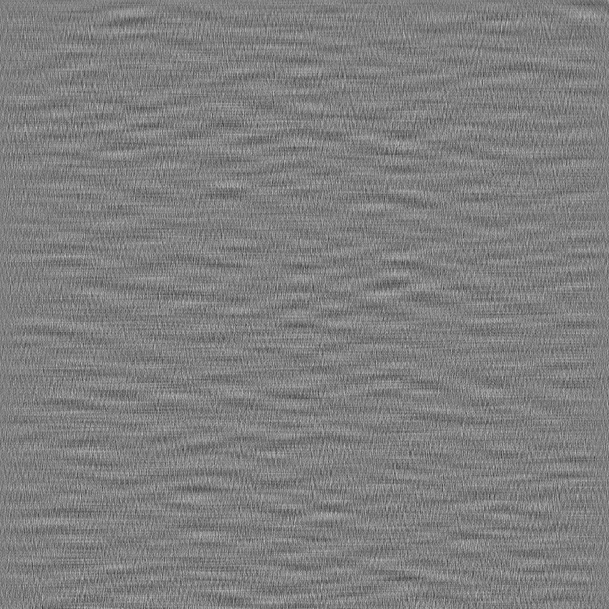

# loopviz



The matrix that plays ([The World Breathes with Me](https://www.youtube.com/watch?v=Dc2CtNFOqV4)) on a loop.

Cut a song into N consecutive windows `w_1 ... w_N` of n samples. There is
an n x n matrix A that advances the song one window at a time and closes
the loop:

```
A w_k = w_{k+1},        A w_N = w_1
```

Iterating A plays the song exactly, forever. A is the exact
[dynamic mode decomposition](https://en.wikipedia.org/wiki/Dynamic_mode_decomposition)
operator of the window sequence, with zero residual and no rank
truncation; the cyclic closure pins its nonzero eigenvalues to the unit
circle, so the loop never decays.

See `doc/math.pdf` for a derivation.

## Pipeline

```
loopviz download --csv tracks.csv     # audio, 16 kHz
scripts/exp_paper_sweep.py            # exact candidates per paper size
loopviz compare                       # pairwise choices in the browser
loopviz fit                           # preference model
scripts/make_prints.py                # print-exact PDFs, 100% scale only
loopviz relief sweep|build|demo       # the same operator as a 3D-printed relief
```

## 3D print

`loopviz relief` displays the operator as a height field: one square
column per entry, height = entry, on a bed of up to 305 mm. Cell pitch
sets the sample rate (`f = rho n^2 / T`, `n = side / pitch`) and layer
height sets the number of distinguishable heights (~5-6 bits on FDM).
The STL is built directly from the matrix (watertight, stepped, no CAD
kernel) and every column top sits on a layer boundary. See `doc/relief.md`
for sizing, printer limits and what the quantized object still plays.

```
loopviz relief sweep --audio song.wav --start 324.68 --end 338.18 --probe
loopviz relief build --audio song.wav --start 324.68 --end 338.18 --pitch 1.5
loopviz relief demo --audio song.wav --start 324.68 --end 338.18   # 2x2 .. 12x12 test meshes
```

## Choosing by comparison

A song has many exact operators (sample rate, density, ink clip and
window count change texture, not playback); which to print is taste, so
taste is measured: pairwise clicks in the compare UI fit a Bradley-Terry
utility on 12 image metrics that ranks the pool per (song, paper).

## Setup

```
uv venv && uv pip install -e ".[dev]" && uv run pytest
```

Requires `ffmpeg` (and `node` for YouTube downloads).
